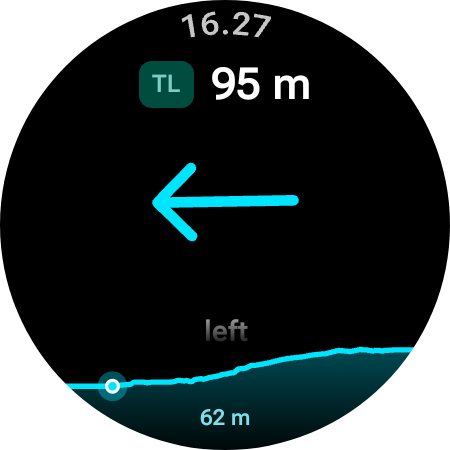
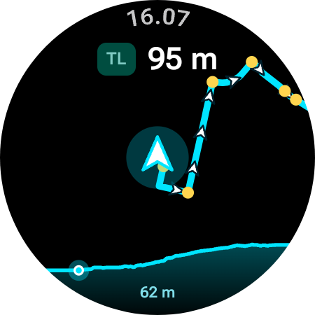

# SimpleRoute

Standalone turn-by-turn navigation for Wear OS 3.0+ paired with an Android companion app, optimized for BRouter GPX cycling routes.

## Motivation

I built SimpleRoute because the Galaxy Watch4 and older models do not support following a route during a cycling workout in Samsung Health. That feature is only available on newer or higher-end models, like the Watch5 Pro and Watch Ultra. If your watch already supports routes in Samsung Health, you should probably just use that instead.

I could not find an existing Wear OS app that worked well enough for me, so I decided to create my own. It is made for me, by me and Antigravity, though Antigravity wrote most, if not all, of the code.

The watch app runs as a foreground service, so hopefully you can also run basic cycling tracking in Samsung Health at the same time to log your ride.

## Features

- **Directional Haptics**: Distinct vibration patterns for left turns, right turns, roundabouts, and U-turns.
- **Dynamic Alerts**: 10-second warning distance calculated from current speed, clamped between 25 m and 90 m.
- **Switchable Views**: Tap or swipe to toggle between an angled vector turn arrow and a bearing-up breadcrumb map.
- **Elevation Horizon**: Docked 2D profile showing 500 m behind and 1,500 m ahead with a live rider marker.
- **Power Conscious**: True black OLED background, 0.1 Hz ambient mode throttling, and automatic wake on upcoming turns.

## Screenshots

| Turn Arrow Mode | Breadcrumb Map Mode |
| :---: | :---: |
|  |  |

## Installation

Connect your phone and watch via ADB or open the project in Android Studio.

1. Install the phone app:
   ```bash
   ./gradlew :mobile:installDebug
   ```
2. Install the watch app:
   ```bash
   ./gradlew :wear:installDebug
   ```

## Usage

### Primary Workflow (Phone to Watch)

1. Plan a route on [BRouter-web](https://brouter.de/brouter-web/) with waypoints and turn instructions enabled (`turnInstructionMode = 3` / OsmAnd mode). Export the `.gpx` file.
2. Open or share the `.gpx` file to SimpleRoute on your phone.
3. Select your paired watch and tap **Send Route to Watch**.
4. Launch SimpleRoute on your watch, choose the route, and start riding.

### Alternative Transfer Methods

- **Wi-Fi Upload**: Tap **Import via Wi-Fi** on the watch, open the displayed address (`http://<watch-ip>:8080`) in any browser on the same network, and upload your file.
- **Direct Storage**: Push files directly to `context.filesDir/routes/` via ADB.
